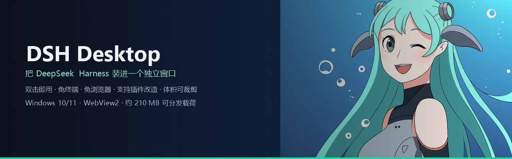
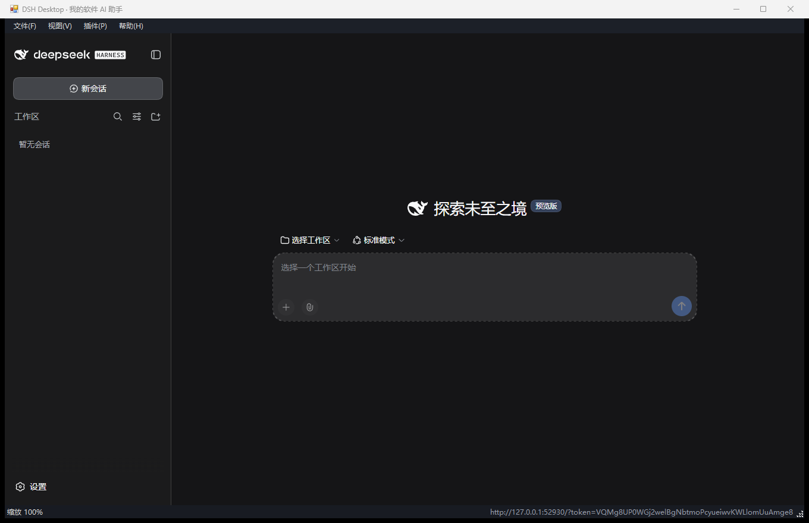
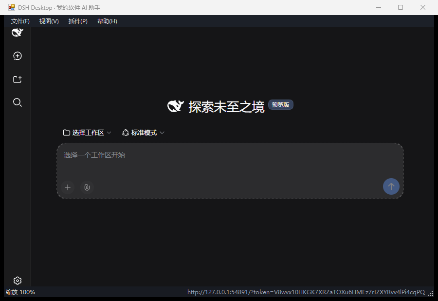
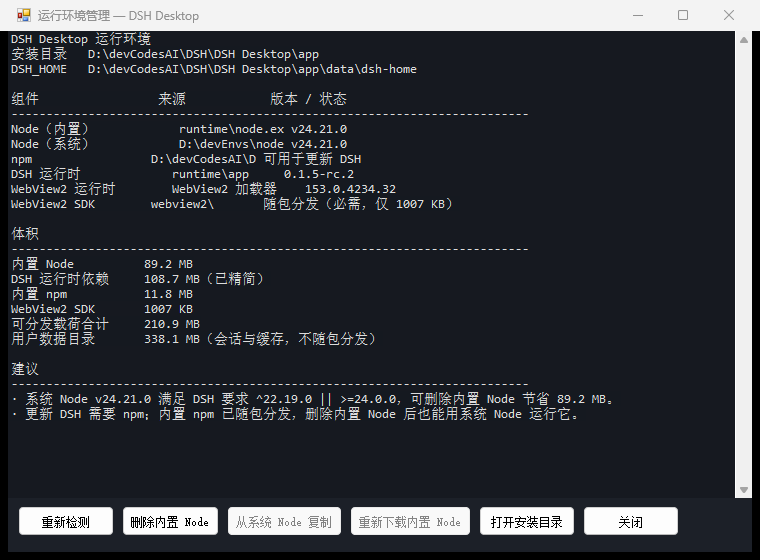
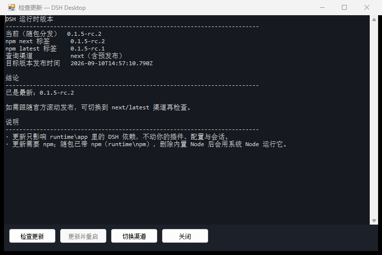
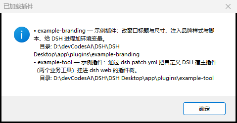
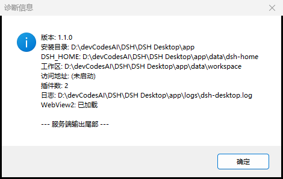

<div align="center">



# DSH Desktop

**Packs [DeepSeek Harness](https://github.com/deepseek-ai/deepseek-harness) into a standalone window: double-click to use it, no terminal, no browser.**

[](https://github.com/LuxUmbra697/DSH-Desktop/releases)
[](https://github.com/LuxUmbra697/DSH-Desktop/stargazers)
[](LICENSE)
[](#quick-start)
[](#how-small-can-it-be-pruned)
[](https://github.com/deepseek-ai/deepseek-harness)

[Download](#quick-start) · [Payload](#how-small-can-it-be-pruned) · [Plugins](#plugin-system) · [简体中文](README.md)

</div>

---

## Interface preview

| Main window: a standalone page, unrelated to the browser | Compact window: responsive layout at 900×620 |
| --- | --- |
|  |  |
| The bundled Node and DSH runtime start `dsh web`, and WebView2 hosts the interface in **its own window**. The example plugin rewrites the window title to "DSH Desktop · My Software AI Assistant"; the brand colour comes from overriding the DSH theme variables. | The window minimum is 420×320, small screens maximize automatically, and the status bar hides itself in narrow windows; the DSH page collapses its own sidebar. The same interface switches clarity per monitor at 125%/150%/200% zoom. |

| Runtime manager: what the machine has and how much you can save | Check for updates: how it differs from the official npx, written in the UI |
| --- | --- |
|  |  |
| Lists the source and version of the bundled Node / system Node / npm / DSH runtime / WebView2 runtime in one table, and computes the distributable payload and the actual footprint. When the system Node meets DSH's requirement you can delete the bundled Node outright and save 89 MB; when the version is too low the button is not clickable, so you cannot delete it and end up unable to start. | Shows the current version, the npm `next`/`latest` tags, the publish time, and the conclusion. Clicking "Update and restart" replaces the DSH dependencies under `runtime\app` with the new version in place, then prunes automatically and restarts the service — plugins, configuration, and sessions are all unaffected. |

| Plugin list: both plugin layers at a glance | Diagnostics: the first place to look when troubleshooting |
| --- | --- |
|  |  |
| Launcher plugins change the window, branding, and injection; DSH host plugins are mounted into the DSH plugin tree through `--patch`. Both example plugins appear in this table. | Version, install directory, DSH_HOME, workspace, access address, plugin count, log path, WebView2 status, and the tail of the server output — sending this screenshot when something breaks locates most of the problem. |

---

## Main features

- **Standalone window**: the bundled Node runtime starts `dsh web`; the launcher resolves the token-carrying address (`GET /?token=…` exchanged for 303 + Cookie) and hosts it with WebView2 — the system browser is never invoked, and you never type `npx @deepseek-ai/dsh web` in a terminal.
- **Zero install, portable**: copy the whole `app\` directory and it works; `data\` holds `DSH_HOME`, the workspace, WebView2 user data, and window state — delete it to return to factory state.
- **Controllable size**: the build prunes automatically (source maps, type declarations, debug symbols, prebuilt binaries for other platforms — about 104 MB in total), and at runtime the bundled Node / bundled npm can be deleted on demand.
- **Runtime self-check**: detects system Node (PATH / registry install location / nvm directories), npm, and the WebView2 runtime; a version that does not qualify only raises a warning and blocks deletion of the bundled copy.
- **In-place DSH update**: queries the `next`/`latest` tags on the npm registry, updates `runtime\app` and restarts with one click in the UI; the channel is switchable, and check-on-startup (`checkUpdatesOnStartup`) and automatic update (`autoUpdate`) are optional.
- **Two plugin layers**: one directory under `plugins\` can change the window title/size, inject CSS/JS, add environment variables and command-line arguments, or use `dsh.patch.yml` to mount custom DSH host plugins (tools, commands, Agent presets) into the plugin tree.
- **Process tree reclamation**: Windows Job Object + `taskkill /T`; closing the window reclaims node and the shells / subagents it spawned, leaving no orphan processes.
- **Window experience**: PerMonitorV2 DPI, remembered window size and position with multi-monitor correction, `Ctrl +/-/0` zoom, F11 full screen, F12 developer tools, Alt shortcut panel.
- **Failure fallback**: when the WebView2 runtime is missing the launcher switches to Edge standalone-window mode, and only falls back to the system browser if that also fails — and it always keeps the service in its own hands.

## Quick start

**Option 1: portable zip (recommended)**

1. Download `DSH-Desktop-<version>-win-x64.zip` from [Releases](https://github.com/LuxUmbra697/DSH-Desktop/releases) and extract it to any directory.
2. Double-click `DSH Desktop.exe`. The first start builds the runtime under `data\dsh-home` (about 10–40 seconds); once the DSH interface appears in the window it is ready to use.
3. Configure the model credentials in DSH under "Settings → Models".

**Option 2: build from source**

```powershell
git clone https://github.com/LuxUmbra697/DSH-Desktop.git
cd DSH-Desktop
.\build.ps1 -Package      # icon + WebView2 SDK + Node + npm + DSH dependencies + prune + compile + ZIP
```

Building needs only Windows 10/11, the .NET Framework 4.8 that ships with it (which provides `csc.exe`), and Node.js (to pull dependencies).

**Requirements**: Windows 10/11 x64; the WebView2 runtime (preinstalled on Win11 and recent Win10, and the launcher falls back to an Edge standalone window when it is missing).

## How small can it be pruned

| Component | Before pruning | After pruning | Notes |
| --- | --- | --- | --- |
| DSH runtime dependencies | 212.4 MB | **108.7 MB** | Deletes source maps 35.8 MB, type declarations 33 MB, debug symbols 19.8 MB, prebuilt binaries for other platforms 11.6 MB, development directories 9.3 MB |
| Node runtime | 89.2 MB | 89.2 MB | Can be deleted when the system already has a qualifying Node |
| Bundled npm | 11.8 MB | 11.8 MB | Keeps "Update DSH" working; can be saved when the system has npm |
| WebView2 SDK | 1.0 MB | 1.0 MB | Required: this is the managed SDK, not the system runtime |
| Launcher | 0.2 MB | 0.2 MB | C# 5, produced by the system compiler |
| **Total** | **314.6 MB** | **210.9 MB** | About **110 MB** after deleting the bundled Node and npm |

The pruning rule is "delete only files the runtime never reads": `package.json`, README and i18n metadata (DSH reads package documentation), all `.js/.mjs/.cjs`, data `.json`, win32-x64 native binaries, and licenses are all kept. Deletion is covered by a full regression: the pruned runtime must still start, load plugins, and pass the 18 self-tests.

## Runtime manager

`File → Runtime manager…` (shortcut `Alt+R`) opens this table, which does three things:

1. **States the current facts**: the path and version of the bundled/system Node, the npm location, the DSH runtime version, the WebView2 runtime version, plus how much space each part takes and the "distributable payload total".
2. **Saves space safely**: "Delete bundled Node" is only clickable when a system Node exists **and satisfies DSH's engine requirement `^22.19.0 || >=24.0.0`**; when the version is too low or no system Node is found the button is greyed out with the reason stated — better to block the deletion than to let you delete it and then fail to open.
3. **Is reversible**: a deleted bundled Node can be restored with "Copy from system Node" or "Re-download bundled Node" (which fetches the version recorded at build time from nodejs.org), or by rerunning `build.ps1`.

## Does DSH update automatically?

The official `npx @deepseek-ai/dsh@next web` resolves the newest version on npm on every start, so **the version changes quietly** — a risk for a product that wants stable reproduction. This project's policy is "pinned by default, updated explicitly":

| Behavior | Default | Config key |
| --- | --- | --- |
| Silently check for a new version after start and report it only in the status bar | On | `checkUpdatesOnStartup` |
| Update and restart automatically when a new version is found | Off | `autoUpdate` |
| Update channel (`next` includes prereleases / `latest` is stable only) | `next` | `channel` |
| Manual check and update | Anytime | `Help → Check for updates…` (`Alt+U`) |

The update installs in place under `runtime\app` with the npm distributed in the package, then automatically prunes dependencies and restarts the service; DSH session records, your plugins, and `config.json` are all unaffected.

## Plugin system

Two layers, both "drop it in and restart", with no npm install:

**1. Launcher plugins** (`plugins\<id>\launcher.json`): change the window title and size, inject CSS/JS, append environment variables and command-line arguments, and point at a DSH patch file. The [example-branding](plugins/example-branding/launcher.json) example demonstrates a title, a size, branding styles, and an injection script at the same time.

**2. DSH host plugins** (`plugins\<id>\dsh.patch.yml` + `dsh\*.mjs`): use DSH's native patch-layer mechanism to insert plugin lines. The [example-tool](plugins/example-tool/) example registers two model-visible tools (`myapp_lookup_ticket`, `myapp_ticket_playbook`) and uses `dshLinkModules` so a plugin can `import '@deepseek-ai/dsh-tools'` directly — the launcher junctions the bundled dependency tree into the plugin directory.

```jsonc
// plugins\my-plugin\launcher.json
{
  "name": "my-plugin",
  "title": "XXX AI Assistant",       // change the window title
  "width": 1360, "height": 880,      // change the window size (takes precedence over config.json)
  "injectCss": ["inject/theme.css"], // inject styles
  "injectJs": ["inject/shortcuts.js"],// inject scripts
  "dshPatch": ["dsh.patch.yml"],     // mount DSH host plugins
  "dshLinkModules": "dsh",           // let the plugin resolve @deepseek-ai/* dependencies
  "env": { "MY_MODE": "desktop" }    // environment variables passed to the dsh process
}
```

For the full field list, precedence, injection context, and troubleshooting see the [plugin guide](docs/PLUGIN-GUIDE.zh.md); for a systematic approach to using DSH as the AI backend of an external application see `docs/ai-backend/` in the upstream repository.

## Command-line arguments and shortcuts

```powershell
"DSH Desktop.exe"                 # normal start
"DSH Desktop.exe" --open runtime  # open a panel right after start: runtime | update | plugins | diagnostics
```

| Shortcut | Action | Shortcut | Action |
| --- | --- | --- | --- |
| `Alt+R` | Runtime manager | `F5` | Reload the page |
| `Alt+U` | Check for updates | `F11` / `Esc` | Full screen / leave full screen |
| `Alt+P` | Loaded plugins | `F12` | Developer tools |
| `Alt+D` | Diagnostics | `Ctrl +` / `Ctrl -` / `Ctrl 0` | Zoom in / zoom out / reset zoom |
| Alt+L | Copy the access address | Alt+M / F10 | Show / hide the window chrome |

> While the page has focus, keystrokes are captured by the injected page listener and sent back through host messages (the standard WebView2 channel), so the shortcuts work inside the page as well.

> To give the DSH interface the whole window, press Alt+M (or F10) to hide the menu and status bars; the choice is written back to showMenuBar / showStatusBar in config.json. The page area is exactly the client area minus those bars, so the chrome never covers the DSH title bar or its input area: four assertions in 	ests\\smoke.ps1 check this.

## Build, self-test, and screenshots

```powershell
.\build.ps1                       # full build (idempotent, existing artifacts are reused)
.\build.ps1 -SkipRuntime          # recompile the launcher only
.\build.ps1 -Force -Package       # force-refresh every payload and package the portable ZIP
.\build.ps1 -NoPrune              # skip pruning (to compare sizes)

.\tests\smoke.ps1                 # the 18 end-to-end self-tests
.\tests\smoke.ps1 -KeepRunning    # keep the window open for manual inspection
.\tests\capture-tour.ps1          # capture the README's 6 interface screenshots
node tests\lan-check.mjs --url <token-carrying URL> --authority <external authority>   # browser-trust fence check
node scripts\prune-runtime.mjs --root app\runtime\app\node_modules --report    # pruning report only, deletes nothing
```

`tests\smoke.ps1` covers: the launcher process, the standalone window appearing, a token on the service address, anonymous requests rejected (401), the token handshake (303 + Cookie), the application document, the API gateway, **a DSH host plugin registering a tool**, the WebView2 render process, the system browser not being opened, `PrintWindow` screenshot evidence, node child processes and the port released after closing, WebView2 process reclamation, and logs and window state written to disk.

## Directory layout

```
DSH-Desktop\
├── app\                        # build output, the whole tree can be copied and distributed
│   ├── DSH Desktop.exe         # launcher (C# 5 / WebView2)
│   ├── config.json             # user configuration
│   ├── runtime\node.exe        # bundled Node (deletable)
│   ├── runtime\npm\            # bundled npm (used to update DSH)
│   ├── runtime\app\            # bundled @deepseek-ai/dsh production dependencies (pruned)
│   ├── webview2\               # WebView2 managed SDK + native loader
│   ├── plugins\                # launcher plugins (synced from the project plugins\)
│   ├── scripts\                # pruning scripts (called by in-place updates at runtime)
│   ├── data\                   # DSH_HOME / workspace / cache / window state (not distributed)
│   └── logs\dsh-desktop.log    # launcher and server logs (4 MB rotation, 3 files kept)
├── src\                        # launcher source: DesktopSupport / RuntimeManager / Updates / Dialogs / DshDesktop
├── scripts\                    # icon and banner generation, WebView2 SDK fetch, pruning, upstream tree check
├── plugins\                    # plugin source: example-branding, example-tool
├── tests\                      # smoke.ps1 / capture-tour.ps1 / http-check.mjs / lan-check.mjs / artifacts
├── docs\                       # plugin guide, interface screenshots
└── build.ps1
```

## FAQ

<details>
<summary><b>Do I need to install Node beforehand?</b></summary>

No, the package ships Node. But if the machine already has a Node satisfying `^22.19.0 || >=24.0.0`, you can delete the bundled one in the runtime manager and save 89 MB.
</details>

<details>
<summary><b>Do I need to install the WebView2 runtime beforehand?</b></summary>

Win11 and most Win10 installations already have it. When it is missing the launcher automatically switches to Edge standalone-window mode (still a standalone window, not a browser tab); only when both are unavailable does it fall back to the system browser. Note that the 1 MB distributed in the package is the WebView2 **managed SDK**, not the system runtime, and cannot be deleted.
</details>

<details>
<summary><b>Why does the first start take tens of seconds?</b></summary>

DSH creates a profile under `$DSH_HOME`, links dependencies into the runtime directory as directory junctions, and then loads the frontend assets. The second start takes seconds. The window shows a progress hint during this time, and logs are written to `app\logs\dsh-desktop.log` at the same time.
</details>

<details>
<summary><b>Can I access it from a phone or tablet?</b></summary>

Not directly: in this DSH version the webserver accepts only `127.0.0.1` and `0.0.0.0`, and it errors explicitly on `0.0.0.0` (the reason being that it would expose remote code execution capability to the network). The right approach is to keep the loopback binding and map the port out through a tunnel (for example `ssh -N -L 3080:127.0.0.1:3080 user@this-pc` from another device), then use `trustedHosts` to allow the authority the tunnel presents when needed.
</details>

<details>
<summary><b>What do I do when an update fails?</b></summary>

Updates go through the npm registry, so failures are usually network or proxy problems, and the UI shows the raw error. A failure does not affect the current version; you can also run `node runtime\npm\bin\npm-cli.js install @deepseek-ai/dsh@<version> --prefix runtime\app --omit=dev --ignore-scripts` manually, then run `node app\scripts\prune-runtime.mjs --root app\runtime\app\node_modules` once more.
</details>

<details>
<summary><b>How do I reset everything?</b></summary>

Just delete `app\data\`: DSH_HOME, sessions, the workspace, WebView2 user data, and window memory are all in there. To restore the factory size, rerun `build.ps1 -Force`.
</details>

## Security and privacy

- **Loopback only**: the service binds `127.0.0.1` by default and exchanges a token for an HttpOnly Cookie; anonymous requests return 401 and requests with a mismatched origin return 403. This project never opens network exposure on your behalf.
- **Credentials are managed by DSH**: model keys live in `$DSH_HOME/.credentials.yaml` or environment variables; the launcher does not read them, print them, or write them to logs.
- **Process boundary**: closing the window ends the whole process tree through a Job Object; plugins and tools are governed by DSH's own permission presets and sandbox policy.
- **Plugins are trusted code**: injected CSS/JS runs in the page context, and plugins mounted by `dsh.patch.yml` run inside the DSH process — install only plugins you wrote yourself. Path arguments allow only relative paths inside the plugin directory; anything outside is ignored and logged.
- **No telemetry**: this launcher sends no statistics of any kind; the only outbound requests are the npm registry version query and the optional Node download from nodejs.org.

## Roadmap

- [ ] Switching between portable mode and service mode (point `DSH_HOME` at the user directory, isolate multiple users)
- [ ] System tray: stay resident in the background, balloon notification for updates
- [ ] Incremental updates: replace only the files that changed, shortening update time
- [ ] A local index for a plugin marketplace: install/disable/reorder from `plugins\` in one click
- [ ] Multiple windows: open several workspace windows on the same DSH instance
- [ ] Interface languages other than Simplified Chinese (launcher strings move to resource files)

## Credits

- [DeepSeek Harness](https://github.com/deepseek-ai/deepseek-harness): the base of this project, MIT licensed. All Agent capabilities come from it.
- [Cordis](https://github.com/cordiverse/cordis): the plugin runtime for DSH.
- [Microsoft WebView2](https://learn.microsoft.com/microsoft-edge/webview2/): in-window embedded rendering.
- The icon and banner were produced by a Qwen image generation model, then given rounded-corner masking and text layout with GDI+.

## License

This project is released under the MIT license; see [LICENSE](LICENSE). Third-party components distributed with the package: Node.js (Node license), Microsoft WebView2 SDK (see `app\webview2\LICENSE.txt`), and DeepSeek Harness with its dependencies (MIT and their respective licenses).

This is a community project with no affiliation to official DeepSeek; the "DeepSeek" and "DeepSeek Harness" trademarks belong to their owners.
