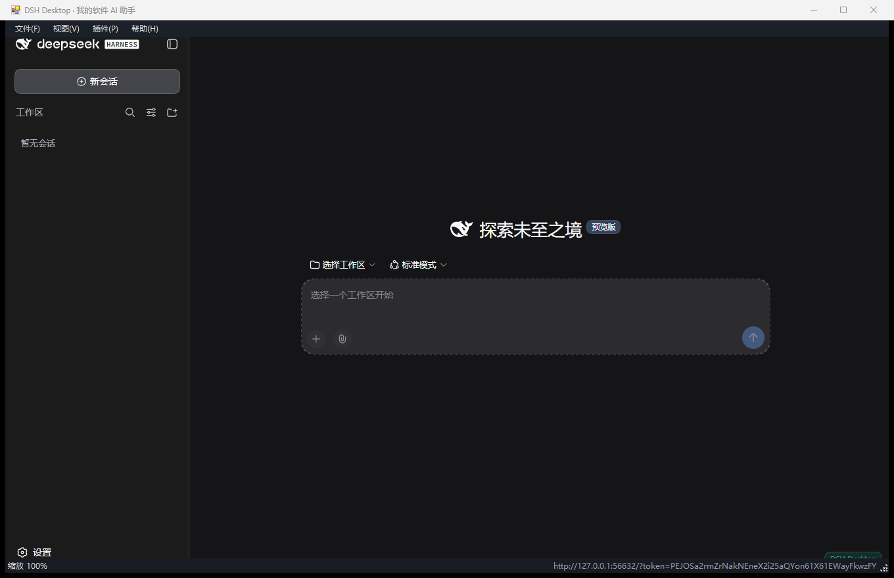

# DSH Desktop

把 [DeepSeek Harness](https://github.com/deepseek-ai/deepseek-harness) 打包成**双击即用**的桌面应用：内置 Node 运行时与 DSH 运行时，用 WebView2 承载一个**独立窗口**，不需要在终端执行 `npx @deepseek-ai/dsh web`，也不会打开浏览器。窗口、品牌、注入界面和 DSH 宿主插件都可以通过 `plugins\` 目录扩展。



上图是实际运行截图，由 `tests\smoke.ps1` 用 `PrintWindow` 从真实窗口抓取：窗口标题被示例插件改写为「DSH Desktop · 我的软件 AI 助手」，顶部品牌条与右下角标识来自注入样式，底部状态栏显示服务地址与当前缩放。整套流程（启动 → 服务就绪 → 插件挂载 → 窗口渲染 → 关闭回收）有 18 项自动化断言覆盖。

## 快速开始

1. 双击 `app\DSH Desktop.exe`。
2. 首次启动会在 `app\data\dsh-home` 建立运行环境（约 5–20 秒），窗口里出现 DSH 界面后即可使用。
3. 需要模型凭据时，在 DSH 的“设置 → 模型”里配置，或在使用真实用户配置模式（见下）后复用 `%USERPROFILE%\.dsh` 里已有的设置与凭据。

### 从源码构建

```powershell
cd "DSH Desktop"
.\build.ps1                     # 完整构建：图标 + WebView2 SDK + Node + DSH 运行时 + 编译 exe
.\build.ps1 -SkipRuntime        # 只重新编译启动器（运行时已经装好时）
.\build.ps1 -Force              # 强制刷新 Node、WebView2、DSH 运行时与插件副本
.\build.ps1 -DshVersion 0.1.5-rc.2
```

构建脚本只需要：Windows 10/11、内置的 .NET Framework 4.8（自带 `csc.exe`）、Node.js（用于拉取依赖）。

### 自测

```powershell
cd "DSH Desktop"
.\tests\smoke.ps1               # 端到端 18 项：启动 → HTTP → 插件挂载 → WebView2 窗口 → 截图 → 关闭回收
.\tests\smoke.ps1 -KeepRunning  # 保留窗口，人工检查界面
node tests\lan-check.mjs --url <带 token 的地址> --authority <外部 authority>   # 信任围栏检查
```

自测覆盖：进程启动、独立窗口出现、服务 URL 带 token、匿名请求被拒、Cookie 握手、应用文档、API 网关、**DSH 宿主插件加载并注册工具**、WebView2 渲染进程、未打开系统浏览器、`PrintWindow` 截图取证、关闭后 node 子进程与端口释放、WebView2 进程回收、日志与窗口状态落盘。窗口截图落在 `tests\artifacts\window.png`。

> WebView2 的宿主进程间通信用命名管道、并在用户数据目录之外写缓存。在受限沙箱（例如把自动化脚本跑在 DSH 自己的沙箱里）中，这部分会被拦住并表现为 `E_UNEXPECTED`/超时；以普通用户双击运行时不受影响。

## 目录结构

```
DSH Desktop\
├── app\                        # 构建产物，整个目录可直接复制/压缩分发
│   ├── DSH Desktop.exe         # 启动器（C# WinForms + WebView2）
│   ├── Microsoft.Web.WebView2.*.dll / WebView2Loader.dll   # exe 同级副本，供 .NET 加载器解析
│   ├── config.json             # 用户配置
│   ├── runtime\node.exe        # 内置 Node 运行时
│   ├── runtime\app\            # 内置 @deepseek-ai/dsh 及其生产依赖
│   ├── webview2\               # Microsoft WebView2 SDK 原件（含版本标记与许可证）
│   ├── plugins\                # 启动器插件（构建时由工程 plugins\ 覆盖同步）
│   ├── data\                   # dsh-home（DSH_HOME）、工作区、WebView2 用户数据、窗口状态
│   └── logs\dsh-desktop.log    # 启动器与服务端日志（4 MB 轮转，保留 3 份）
├── src\                        # 启动器源码（C# 5，随构建用 csc.exe 编译）
├── scripts\                    # 图标生成、WebView2 SDK 下载、上游树校验
├── plugins\                    # 插件源码目录：example-branding（界面）与 example-tool（DSH 宿主插件）
├── tests\                      # 端到端自测、HTTP 校验、信任围栏检查
├── docs\PLUGIN-GUIDE.zh.md     # 插件开发指南
├── build.ps1
└── config.json                 # 构建时复制到 app\config.json 的模板
```

## config.json

| 键 | 默认 | 说明 |
| --- | --- | --- |
| `title` | `DSH Desktop` | 窗口标题 |
| `host` | `127.0.0.1` | DSH 绑定地址。只支持 `127.0.0.1`；写 `0.0.0.0` 会被 DSH 的安全检查拒绝，启动器会退回回环并给出提示 |
| `port` | `0` | `0` 表示由系统分配空闲端口，启动器从日志里读取真实端口 |
| `trustedHosts` | `[]` | 追加到 `--trusted-host`，供反向代理或隧道对外呈现的 authority 使用 |
| `dshHome` | `""` | `""` = 便携模式（`app\data\dsh-home`）；`user` = 复用 `%USERPROFILE%\.dsh`；也可写绝对路径 |
| `workspace` | `""` | Agent 的默认工作区；空 = `app\data\workspace` |
| `width` / `height` | `1280` / `840` | 初始窗口尺寸 |
| `minWidth` / `minHeight` | `420` / `320` | 最小窗口尺寸 |
| `maximizeOnSmallScreen` | `true` | 屏幕小于 1440×900 时自动最大化 |
| `lan` | `false` | 远程访问模式：保留回环绑定，并把配置里的 `trustedHosts` 与实际端口组合成可信 authority。DSH 本版本拒绝 `0.0.0.0`，远程接入请走隧道或反向代理 |
| `devTools` | `true` | 允许 F12 开发者工具 |
| `openExternalLinks` | `true` | 页面里的外链用系统浏览器打开，而不是在应用内新建窗口 |
| `pluginsDisabled` | `false` | 关闭全部启动器插件 |
| `startupTimeoutSeconds` | `240` | 等待服务就绪的上限 |
| `extraArgs` | `[]` | 追加到 `dsh web` 的命令行参数 |
| `env` | `{}` | 追加到 `dsh web` 子进程的环境变量 |
| `zoomFactor` | `1.0` | 初始缩放 |

窗口位置、尺寸和最大化状态自动保存在 `app\data\window.json`，多显示器切换时会做可见性校正。

## 多端与响应式

- **高 DPI**：清单声明 `PerMonitorV2`，在 125%/150%/200% 缩放下按显示器切换清晰度。
- **窗口自适应**：最小尺寸 420×320；小屏自动最大化；状态栏在宽度小于 720 时自动隐藏；窗口尺寸与位置按多显示器可见性校正后恢复。
- **缩放**：`Ctrl + 加号 / 减号 / 0`，并保留 DSH 页面自身的响应式布局（侧栏折叠等）。
- **窄屏与触屏**：插件可用 `@media (max-width: …)` 与 `@media (pointer: coarse)` 调整密度与热区，示例见 `plugins\example-branding\inject\theme.css`。
- **远程设备（手机/平板/另一台电脑）**：DSH 本版本的 webserver 只接受 `127.0.0.1` 与 `0.0.0.0`，并对 `0.0.0.0` 显式报错（理由是把远程代码执行能力暴露到网络），因此**不能**通过局域网直连。正确做法是保持回环绑定，用隧道把端口映射出去再访问，例如：
  ```powershell
  ssh -N -L 3080:127.0.0.1:3080 user@this-pc   # 在另一台设备上执行
  ```
  然后在 `config.json` 里把 `port` 固定为 `3080`、`lan` 设为 `true`，隧道侧用 `http://127.0.0.1:3080/?token=...` 访问即可；若隧道或反向代理对外呈现的是另一个 authority，用 `trustedHosts` 把它加进白名单。

## 插件

两层扩展模型：

1. **启动器插件**（`plugins\<id>\launcher.json`）：改窗口标题与尺寸、注入 CSS/JS、追加环境变量与命令行参数、挂载 DSH 宿主插件补丁。零编译，改完重启即生效。
2. **DSH 宿主插件**（`plugins\<id>\dsh.patch.yml` + 插件包）：用 DSH 原生的 patch 层机制把自定义 Agent 能力（工具、命令、LLM 供应商、MCP 等）插入 `dsh web` 的插件树。

详见 [docs/PLUGIN-GUIDE.zh.md](docs/PLUGIN-GUIDE.zh.md) 与 [plugins/README.md](plugins/README.md)。仓库级方案见 `..\docs\ai-backend\`。

## 启动时序

```
DSH Desktop.exe
  ├─ 读取 config.json，加载 plugins\*\launcher.json
  ├─ 组装命令：runtime\node.exe runtime\app\node_modules\@deepseek-ai\dsh\lib\bin.js
  │            web --no-open --host <host> --port <port> [--trusted-host ...] [--patch ...]
  ├─ 环境变量：DSH_HOME、DSH_DESKTOP*、插件 env、NODE_COMPILE_CACHE
  ├─ 等待 stdout 出现 "dsh web: http://127.0.0.1:<port>/?token=..."
  ├─ 解析 token URL → WebView2 导航（303 + HttpOnly Cookie 完成鉴权）
  ├─ 注入插件 CSS/JS 与 window.__DSH_DESKTOP__
  └─ 关窗 → Job Object 结束整棵进程树（node、pwsh、子 Agent）
```

## 故障排查

| 现象 | 处理 |
| --- | --- |
| 窗口空白/一直显示“正在启动” | 看 `app\logs\dsh-desktop.log`；“诊断信息”对话框会附带服务端输出尾部 |
| 提示未检测到 WebView2 运行时 | 启动器自动改用 Edge 独立窗口模式；安装 WebView2 Runtime 可恢复内嵌窗口 |
| 端口被占用 | `port` 设 `0`（默认）由系统分配；或改成空闲端口 |
| 想用已有 DSH 配置和凭据 | `dshHome` 设为 `user`，复用 `%USERPROFILE%\.dsh` |
| 运行环境损坏 | 删除 `app\data\dsh-home\profiles\web` 后重启，DSH 会重建 profile |
| 插件没有生效 | “已加载插件”对话框确认清单被读取；`launcher.json` 解析失败会写进日志 |

## 与上游 `apps/desktop` 的关系

上游仓库的 `apps/desktop` / `apps/desktop-host` 是 DSH 官方桌面端方向；本项目是独立、零外部依赖的打包方案，特点是不需要 Electron、不需要 pnpm 全量安装，直接复用 Windows 自带的 WebView2 与 .NET Framework 编译器，并把“插件改造 exe”作为一等能力。两者的 DSH 插件（`cordis.patch.yml` / profile 层）机制完全一致，插件可互相迁移。

## 许可

DeepSeek Harness 本身为 MIT。随包分发的 Microsoft WebView2 SDK 受其 `app\webview2\LICENSE.txt` 约束；Node.js 运行时受 Node 许可证约束。
